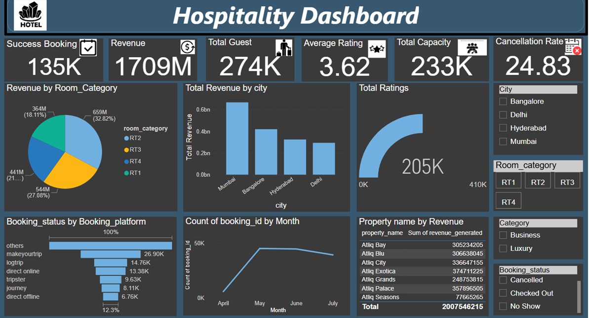
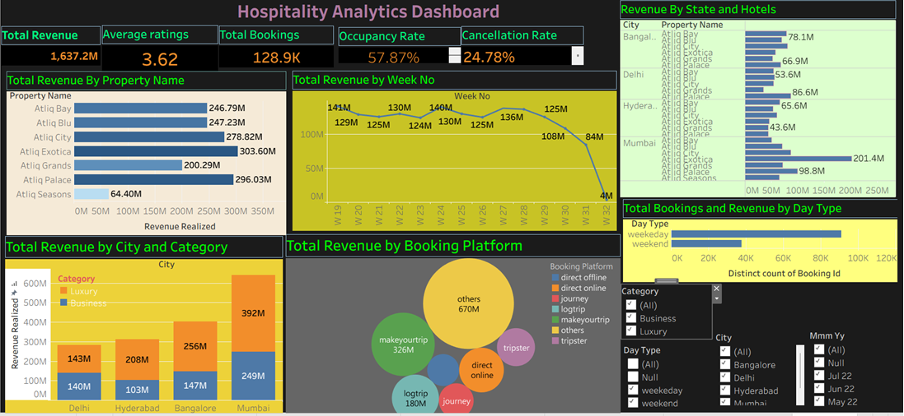
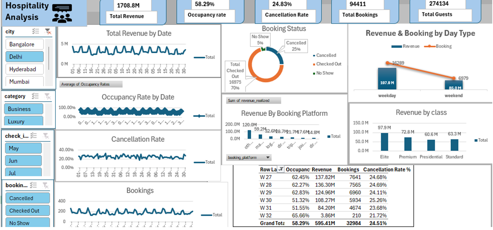

# 🏨 Hospitality Performance & Revenue Optimization Analysis

## 🎯 Project Overview
This project provides a comprehensive data analytics solution for **Atliq Hotels**, an elite hospitality chain operating across major Indian metropolises (Delhi, Mumbai, Hyderabad, and Bangalore). Facing aggressive market competition and revenue leakage from cancellations and unoptimized room pricing, this multi-tool analytics pipeline uncovers hidden operational trends to maximize **Occupancy Rates** and **RevPAR (Revenue Per Available Room)**.

The project demonstrates an end-to-end data analytics workflow, utilizing **MySQL** for data warehousing and extraction, alongside synchronized interactive dashboards built in **Power BI**, **Tableau**, and **Excel** to serve stakeholders at multiple organizational tiers.

---

## 🗂️ Repository Structure
* `/SQL_Scripts`: Production-ready MySQL scripts handling data aggregations, metric calculations, and dimension table joins.
* `/Dashboards`: High-resolution visual layout screenshots demonstrating interface design and UX execution.

---

## 🔍 Data Architecture & Model Verification

The project is built upon a relational star schema composed of 3 dimension tables and 2 core fact tables:
* `dim_hotels`: Details property footprints across cities and tiers (`Business` vs. `Luxury`).
* `dim_rooms`: Maps room categories from Standard (`RT1`) up to Presidential (`RT4`) suites.
* `dim_date`: Segments time parameters by week numbers and day categories (`Weekend` vs. `Weekday`).
* `fact_bookings`: Tracks individual room reservations, customer ratings, cancellation logs, and realized revenues.
* `fact_aggregated_bookings`: Monitors property-level daily inventory capacity against successful stays.

> 📁 **Repository Artifacts Note:** High-resolution presentation layouts are detailed below. To inspect the live data models, entity relationships, and calculation mechanics that power these visuals, you can download the raw working workbooks directly via these secure download vectors:
> 
> * 📊 [Download Raw Power BI Model (.pbix)](PASTE_YOUR_GOOGLE_DRIVE_POWERBI_LINK)
> * 🎨 [Download Raw Tableau Packaged Workbook (.twbx)](PASTE_YOUR_GOOGLE_DRIVE_TABLEAU_LINK)
> * 📈 [Download Raw Excel Source Model (.xlsx)](PASTE_YOUR_GOOGLE_DRIVE_EXCEL_LINK)

---

## 📊 Business Intelligence Dashboards (Multi-Tool Implementation)

> 💡 **Project Delivery Note:** High-resolution operational layout previews are embedded below for immediate documentation review. The interactive application layers can be accessed utilizing the cloud data download framework established above.

### 1. Power BI Executive Interface

* **Focus Layer:** Advanced DAX calculations establishing robust centralized KPIs (`Occupancy %`, `RevPAR`, `Cancellation Rate`) filterable by room class and city.

### 2. Tableau Strategic View

* **Focus Layer:** Deep-dive visual scatter charts highlighting booking platform yields (e.g., MakeMyTrip vs. Direct Bookings) alongside room category revenue variations.

### 3. Excel Operational Model

* **Focus Layer:** Clean, automated Pivot Tables, dynamic slicers, and conditional formatting maps tracking capacity utilization levels across properties like *Atliq Grands* and *Atliq Exotica*.

---

## 💡 Executive Insights & Strategic Deliverables

1. **The Booking Platform Churn Risk:** Third-party booking engines like `logtrip` and `makemytrip` demonstrate volatile cancellation ratios compared to direct offline or online configurations. *Action:* Deploy exclusive loyalty perks (e.g., complimentary room upgrades) on native booking channels to shift consumer traffic away from high-churn platforms.
2. **Category Performance Variance:** The `Luxury` property tier (e.g., Atliq Exotica, Atliq Blu) drives over 60% of top-line revenue volumes, yet room classes `RT1 (Standard)` and `RT2 (Elite)` suffer from lower capacity utilization. *Action:* Package lower-tier rooms in underperforming regions with corporate business amenities during weekdays to balance the overall occupancy index.
3. **The Weekend Demand Surge:** Cross-referencing `dim_date.day_type` reveals a massive weekend compression curve where occupancy spikes organically, while weekday pricing remains stagnant. *Action:* Introduce automated dynamic pricing structures that automatically raise room rates by 15-20% on Friday/Saturday bookings while running targeted corporate discounts from Monday to Thursday.
